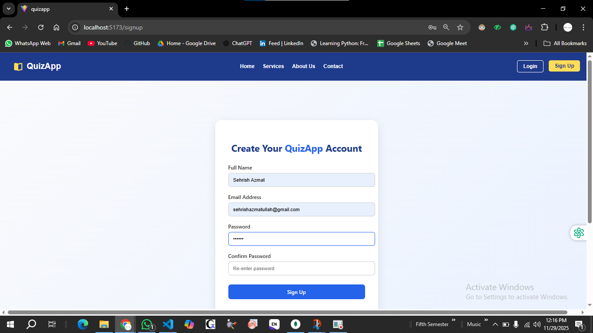
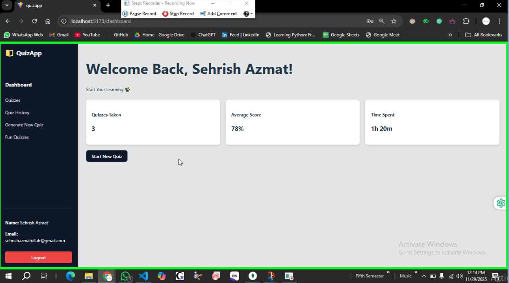
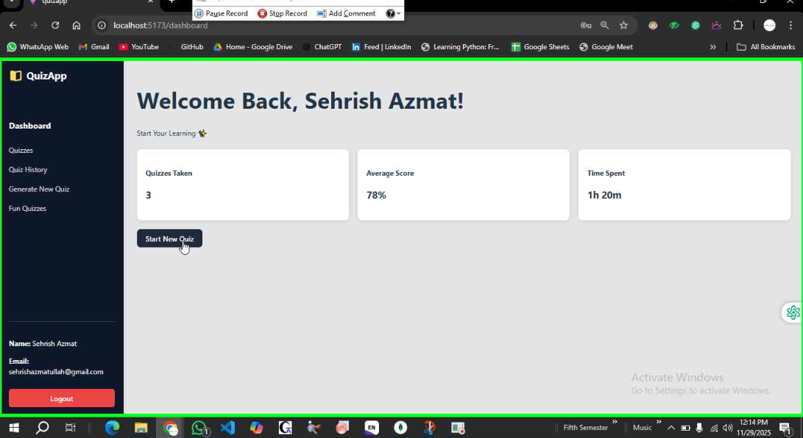
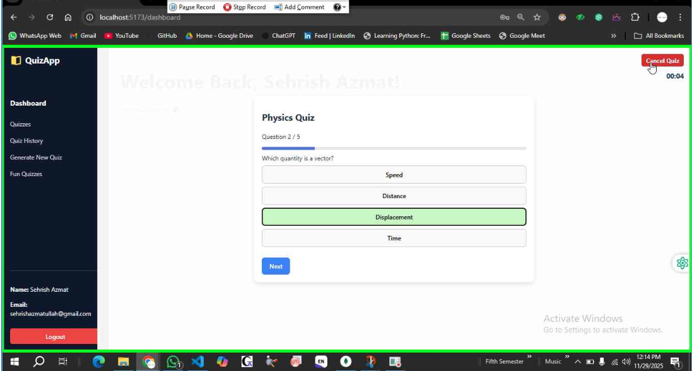

---

# **📘 QuizApp – MERN Stack Project**

A full-stack Quiz Management System built using **MongoDB, Express, React, and Node.js (MERN)**.
It includes authentication, Student Dashboard, Admin Dashboard (further updates), and a dynamic quiz system with timers, analytics, and result evaluation.

---

## ⭐ **Project Overview**

This application allows users to:

* Create an account & login
* Access a personalized **Student Dashboard**
* Attempt quizzes with:

  * Timer countdown
  * Disabled **Next** button until an option is selected
  * Cancel Quiz option
  * Detailed final result with explanations
* Access **Admin Dashboard**:

  * View users
  * Manage data (extendable)

---

## 🏗️ **Tech Stack**

| Layer    | Technology                         |
| -------- | ---------------------------------- |
| Frontend | React.js, Vite, CSS                |
| Backend  | Node.js, Express.js                |
| Database | MongoDB                            |
| Tools    | Git, VS Code, Postman, JWT, bcrypt |

---

## 📁 **Updated Folder Structure**

```
|__Screenshots                #demo of website 
├── quizapp/                 # Main project folder
│   ├── backend/
│   │   ├── myFiles/         # Routes, controllers, schema
│   │   │   ├── myschema/
│   │   │   ├── ...
│   │   ├── db.js
│   │   ├── index.js         # Backend entry file
│   │   ├── package.json
│   │
│   ├── node_modules/
│   │
│   ├── public/
│   │
│   ├── src/
│   │   ├── assets/
│   │   ├── components/
│   │   │   ├── AdminDashboard.jsx
│   │   │   ├── Dashboard.jsx
│   │   │   ├── Dashboard.css
│   │   │   ├── Navbar.jsx
│   │   │   ├── Footer.jsx
│   │   │   ├── LoginPage.jsx
│   │   │   ├── Signup.jsx
│   │   ├── pages/
│   │   ├── utils/
│   │   ├── App.jsx
│   │   ├── App.css
│   │   ├── main.jsx
│   │
│   ├── package.json
│   ├── vite.config.js
│
└── README.md
```

---

## 🔐 **Authentication Flow**

* User registers → Data stored in MongoDB
* Passwords hashed using **bcrypt**
* Login verified through **JWT token**
* Token stored in **localStorage**
* Protected Routes: Dashboard cannot open without valid token

---

## 🧭 **Project Pages**

| Page              | Path              | Description               |
| ----------------- | ----------------- | ------------------------- |
| Login             | `/login`          | User login                |
| Signup            | `/signup`         | Create new account        |
| Student Dashboard | `/dashboard`      | Start quizzes, view stats |
| Admin Dashboard   | `/admindashboard` | Admin management          |
| Quiz Page         | `/quiz/:subject`  | Attempt quiz              |
| Result Page       | `/result`         | Detailed result analysis  |

---

## 🚀 **How to Run the Project**

### **1. Install Dependencies**

#### Backend

```bash
cd quizapp/backend
npm install
```

#### Frontend

```bash
cd quizapp
npm install
```

---

### **2. Setup `.env` inside Backend Folder**

Create:

```
quizapp/backend/.env
```

Add:

```
MONGO_URI=your_mongodb_connection_string
JWT_SECRET=yourSecretKey
PORT=5000
```

---

### **3. Start the Project**

#### Backend

```bash
cd quizapp/backend
npm start
```

#### Frontend

```bash
cd quizapp
npm run dev
```

---

## 🧪 **API Endpoints**

| Method | Endpoint     | Description         |
| ------ | ------------ | ------------------- |
| POST   | /register    | Register user       |
| POST   | /login       | Login user          |
| GET    | /getusers    | Fetch users (Admin) |
| POST   | /quiz/submit | Submit quiz         |

---

## 🎯 **Quiz Features (Latest Version)**

✔ Responsive Quiz Card
✔ Timer inside quiz
✔ Disabled “Next” until option selected
✔ Cancel Quiz (redirects to result page)
✔ Time spent per question
✔ Full question review including:

* Selected option
* Correct answer
* Explanation

✔ Score highlighted
✔ Back to Dashboard button
✔ Dashboard stats hidden while quiz is active

---

## 🛠️ **Troubleshooting**

| Issue                  | Fix                                  |
| ---------------------- | ------------------------------------ |
| MongoDB not connecting | Check `.env` MONGO_URI value         |
| Token missing          | Login again (localStorage cleared)   |
| Frontend not loading   | Run `npm install` then `npm run dev` |
| Backend port error     | Change `PORT` in `.env`              |

---

# 🌟 Project Screenshots Documentation

This section provides all important screenshots of the application for quick visual reference.  
Each screenshot showcases a core part of the user experience.

---

## 📸 Project Screenshots

### 🧭 SignUp


---

### 🧭 Login


---

### 🧭 Dashboard


---

### 📝 Start Quiz Page


---

### 🧮 Quiz Attempt Page


---

### 🧭 Cancel Quiz Button


---

### 🎉 Quiz Result Summary


---

### 🧭 Logout


---


